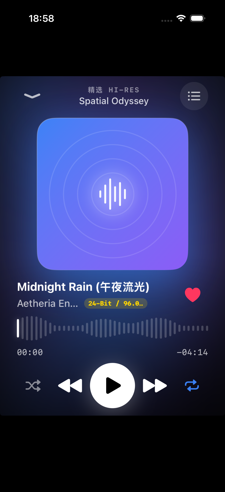
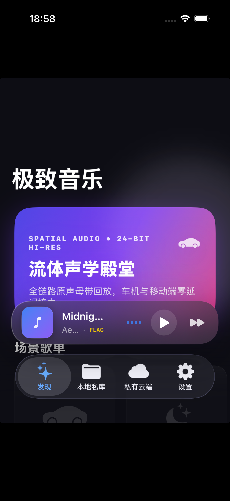
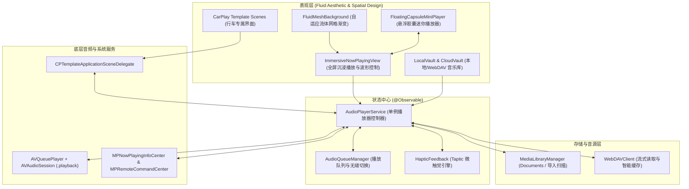

# 极致音乐 (JiZhi Music)

<p align="center">
  
  &nbsp;&nbsp;&nbsp;&nbsp;
  
</p>

<p align="center">
  
  
  
  
  
</p>

---

## 📖 简介 (Introduction)

**「极致音乐 (JiZhi Music)」** 是一款为纯粹听觉、流体光影与无缝车载体验而生的个人高保真无损音乐播放器。

我们厌倦了商业流媒体软件充斥的社交广场、信息流推送与冗余功能。**极致音乐**选择反向克制：专注于**物理级触觉反馈、自适应流体声学美学、本地私库/自建私有云（WebDAV / Alist）双轨音源**，并深度整合 **Apple CarPlay** 原生车载体验，打造行车与移动端零延迟接力的极致体验。

---

## ✨ 核心特性 (Key Features)

### 🎨 1. 流体声学美学 (Fluid Acoustic Design)
* **动态流体光环 (Adaptive Mesh Gradient)**：采用 iOS 18+ 原生 `MeshGradient` 算法，实时提取当前播放音轨的色彩声学光谱，背景如液体般平滑流淌漂移。
* **悬浮胶囊迷你播放器 (Floating Capsule Mini Player)**：悬浮于原生 TabBar 之上，拥有超薄毛玻璃质感、微光边缘走线与实时声学动态跳动波形。支持向左/向右滑动手势切歌、上滑自然展开全屏。
* **空间 3D 拟真视差 (Spatial 3D Tilt)**：在全屏沉浸播放页，封面支持随手势拖动与微角度晃动产生 3D 浮动感，仿若置身声学空间。
* **动态声波进度条 (Waveform Scrubber)**：高精度拟真音频柱状波形替代单调细横线，拖动时配合 **Taptic Engine** 输出机械齿轮般的微妙刻度感（Tick Feedback）。
* **黑胶唱片模式 (Vinyl Turntable Mode)**：支持一键切换至黑胶唱盘交互模式，同心音轨光晕随音乐节奏平滑旋转。

### 🚗 2. Apple CarPlay 深度车载整合
* **原生 CPTemplate 架构**：严格遵循 Apple 驾驶安全规范，基于 `CPTemplateApplicationSceneDelegate` 与 `CPInterfaceController` 构建车载专用模板树。
* **驾驶精选与大触控设计**：提供行车专属快捷歌单、收藏音轨与大图标触控列表，切歌毫秒级推入 `CPNowPlayingTemplate.shared`。
* **双端接力 (Handoff)**：上车连上 CarPlay 时进度零延迟接力，支持连车自动续播；下车断开时自动淡出暂停。
* **全功能硬件支持**：完美支持车载多功能方向盘按键、车机旋转物理旋钮与锁屏控制中心（`MPNowPlayingInfoCenter` & `MPRemoteCommandCenter`）。

### 📂 3. 本地私库与私有云双轨音源
* **本地私库 (Local Vault)**：
  * 支持沙盒 `Documents` 目录自动扫描与系统「文件」App 导入。
  * 自动解析 FLAC / ALAC / WAV / MP3 / DSD 元数据标签（ID3v2 / Vorbis Comments）与内嵌专辑封面。
  * 开放 Finder / iTunes 文件共享与隔空投送（AirDrop）快速传歌。
* **私有云端 (Cloud Vault - WebDAV / Alist)**：
  * 自由对接 NAS（群晖、QNAP、TrueNAS）、Alist 或私有 WebDAV 服务器。
  * 支持高保真音频流式在线点播，具备边播边存智能本地缓存机制。

---

## 🏗️ 架构设计 (Architecture)



---

## 🛠️ 技术选型 (Tech Stack)

* **开发语言**：Swift 6.0（开启严格并发类型检查，杜绝线程数据竞争）
* **UI 框架**：SwiftUI 6.0+（结合 `@Observable` 宏、`MeshGradient`、物理弹簧动画）
* **音频引擎**：`AVFoundation` (`AVQueuePlayer`, `AVAudioSessionCategoryPlayback`)
* **车载系统**：`CarPlay.framework` (`CPTemplateApplicationSceneDelegate`, `CPTabBarTemplate`, `CPListTemplate`, `CPNowPlayingTemplate`)
* **系统联动**：`MediaPlayer.framework` (`MPNowPlayingInfoCenter`, `MPRemoteCommandCenter`)
* **触觉反馈**：`UIKit` (`UIImpactFeedbackGenerator`, `UISelectionFeedbackGenerator`)
* **工程构建**：`XcodeGen`（声明式 `project.yml`，零冲突规范化工程生成）

---

## 🚀 编译与运行 (Quick Start)

### 1. 前置要求
* macOS 14.0+ / macOS 15+ / macOS 26+
* Xcode 16.0+ / Xcode 26+
* 安装 `xcodegen`（如果未安装）：
  ```bash
  brew install xcodegen
  ```

### 2. 克隆仓库与生成工程
```bash
git clone https://github.com/chenpingan529/JiZhiMusic.git
cd JiZhiMusic

# 自动生成 Xcode 项目
xcodegen generate
```

### 3. 打开项目并运行
```bash
open JiZhiMusic.xcodeproj
```
* 在 Xcode 目标设备中选择任意 **iPhone 16 / 17 模拟器** 或真机，点击 **Run (⌘ + R)** 即可体验。

### 4. 预览 Apple CarPlay 车载界面
1. 启动 iOS 模拟器；
2. 在模拟器顶部菜单栏点击：`I/O` -> `External Displays` -> `CarPlay`；
3. 车载中控大屏将立即弹出，点击「极致音乐」图标即可体验全功能车载多媒体模板交互。

---

## 📄 开源许可证 (License)

本项目基于 [MIT License](LICENSE) 开源发布。欢迎提 Issue、PR 共同打造极致声学体验！
