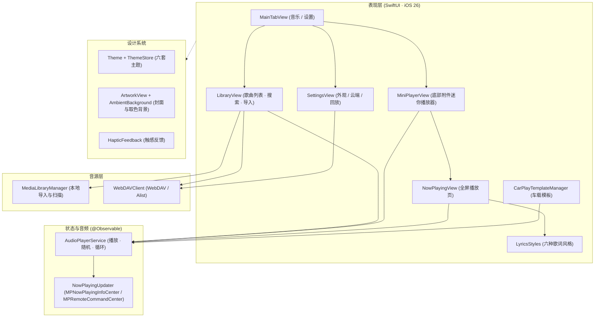

# 极致音乐 (JiZhi Music)

<p align="center">
  
  &nbsp;&nbsp;&nbsp;&nbsp;
  
</p>

<p align="center">
  
  
  
  
  
</p>

---

## 📖 简介 (Introduction)

**「极致音乐 (JiZhi Music)」** 是一款为纯粹听觉、流体光影与无缝车载体验而生的个人高保真无损音乐播放器。

我们厌倦了商业流媒体软件充斥的社交广场、信息流推送与冗余功能。**极致音乐**选择反向克制：专注于**物理级触觉反馈、自适应流体声学美学、本地私库/自建私有云（WebDAV / Alist）双轨音源**，并深度整合 **Apple CarPlay** 原生车载体验，打造行车与移动端零延迟接力的极致体验。

---

## ✨ 核心特性 (Key Features)

### 🎨 1. 克制的原生设计 (iOS 26 Liquid Glass)
* **两个 Tab，一目了然**：「音乐」即全部歌曲列表（本地与云端合并，顶部搜索，右上角 `+` 从「文件」导入）；「设置」集中管理外观、云端与回放选项。
* **六套主题**：白色 / 暖色 / 清新 / 红色 / 深色 / 黑色，风格差异鲜明，切换即时生效并持久化；强调色、开关、Tab 栏同步变化。
* **底部附件迷你播放器**：基于 `tabViewBottomAccessory`，左右滑动切歌，点击以 `zoom` 转场展开全屏播放页；滚动时 Tab 栏自动收起。
* **全屏播放页**：大封面 + 封面取色氛围背景，音质徽章（格式 · 位深 · 采样率），随机 / 循环（列表 / 单曲）、AirPlay 输出，下滑即可关闭。
* **触感反馈**：切 Tab、切歌、拖动进度均配有 Taptic 反馈，可在设置中关闭。

### 🎤 2. 多风格歌词
在播放页点击歌词按钮进入歌词模式，在「设置 → 外观」中选择风格：

| 风格 | 效果 |
| --- | --- |
| 经典滚动 | 当前行高亮，逐行平滑滚动，点击任意行跳转播放 |
| 卡拉 OK | 从左到右逐字填色，已填满的字带柔光 |
| 逐字弹跳 | 每个字随进度依次跳起、放大并变为强调色 |
| 霓虹律动 | 霓虹辉光随频谱电平与节拍呼吸 |
| 居中聚焦 | 当前句大字居中，上下句淡化；新行模糊浮入 |
| 粒子浮现 | 上浮光点背景，每个字从模糊碎片聚拢成形 |

### 🚗 3. Apple CarPlay 车载整合
* **原生 CPTemplate 架构**：基于 `CPTemplateApplicationSceneDelegate` 与 `CPInterfaceController` 构建车载模板树，切歌推入 `CPNowPlayingTemplate.shared`。
* **锁屏与硬件控制**：接入 `MPNowPlayingInfoCenter` 与 `MPRemoteCommandCenter`，支持方向盘按键、锁屏与控制中心。

### 📂 4. 本地与私有云双音源
* **本地**：通过系统「文件」App 导入 FLAC / ALAC / WAV / MP3 等音频，支持 Finder 文件共享。
* **私有云**：在「设置 → 云端」对接 WebDAV / Alist（群晖、QNAP、TrueNAS 等 NAS），歌曲直接出现在「音乐」列表中。

---

## 🏗️ 架构设计 (Architecture)



---

## 🛠️ 技术选型 (Tech Stack)

* **开发语言**：Swift 6.0
* **UI 框架**：SwiftUI（iOS 26 Liquid Glass、`@Observable`、`tabViewBottomAccessory`、`navigationTransition(.zoom)`）
* **音频引擎**：`AVFoundation`（`AVPlayer`、`AVAudioSession` `.playback`）
* **车载系统**：`CarPlay.framework`（`CPTemplateApplicationSceneDelegate`、`CPListTemplate`、`CPNowPlayingTemplate`）
* **系统联动**：`MediaPlayer.framework`（`MPNowPlayingInfoCenter`、`MPRemoteCommandCenter`）
* **触觉反馈**：`UIKit`（`UIImpactFeedbackGenerator`、`UISelectionFeedbackGenerator`）
* **工程构建**：`XcodeGen`（声明式 `project.yml`）

---

## 🚀 编译与运行 (Quick Start)

### 1. 前置要求
* macOS 26+
* Xcode 26+（最低部署目标 iOS 26.0）
* 安装 `xcodegen`（如果未安装）：
  ```bash
  brew install xcodegen
  ```

### 2. 克隆仓库与生成工程
```bash
git clone https://github.com/chenpingan529/JiZhiMusic.git
cd JiZhiMusic

# 自动生成 Xcode 项目
xcodegen generate
```

### 3. 打开项目并运行
```bash
open JiZhiMusic.xcodeproj
```
* 在 Xcode 目标设备中选择任意 **iOS 26 模拟器** 或真机，点击 **Run (⌘ + R)** 即可体验。

### 4. 预览 Apple CarPlay 车载界面
1. 启动 iOS 模拟器；
2. 在模拟器顶部菜单栏点击：`I/O` -> `External Displays` -> `CarPlay`；
3. 车载中控大屏将立即弹出，点击「极致音乐」图标即可体验全功能车载多媒体模板交互。

---

## 📄 开源许可证 (License)

本项目基于 [MIT License](LICENSE) 开源发布。欢迎提 Issue、PR 共同打造极致声学体验！
